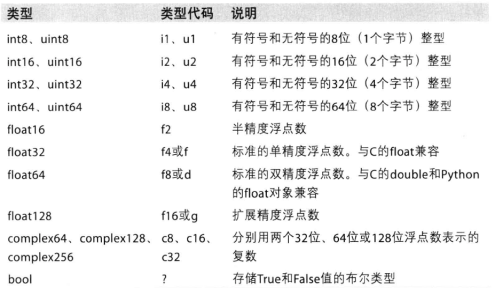
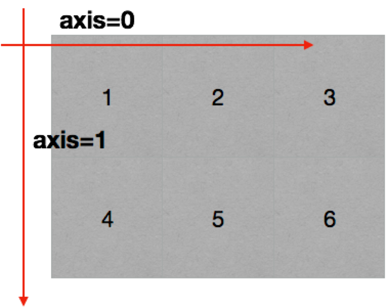
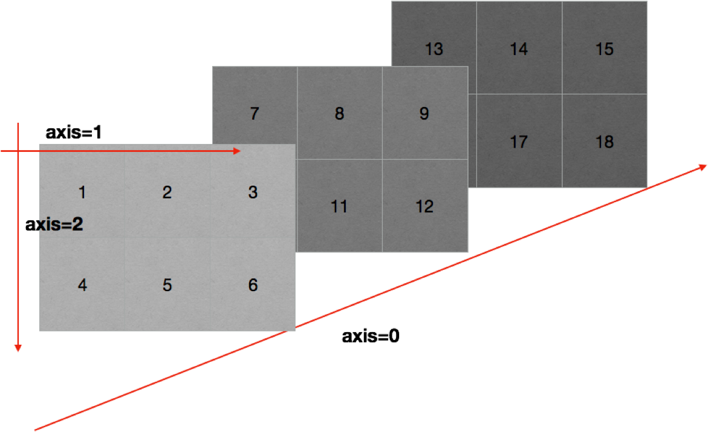
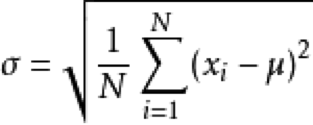

# 创建数组

### 1、创建数组(矩阵)

**np.arange与np.array**

```python
	import numpy as np
	a = np.array([1,2,3,4,5])
	b = np.array(range(1, 6))
	c = np.arange(1, 6)
```

+ <font color=red >注意: 上面的a, b, c 内容相同, 注意arange和range的区别</font>
+ np.arange的用法: arange([start,] stop[, stop,], dtype=None)

**查看数组的类名**

```python
	In [2]: a = np.array([1,2,3])
	In [3]: type(a)
	Out[3]: numpy.ndarray
```

**查看数据的类型**

```python
	In [6]: a.dtype
	Out[6]: dtype('int64')
```

### 2、Numpy中常见的更多数据类型



**指定创建的数组的数据类型**

```python
	In [7]: a = np.array([1, 2, 3], dtype=np.bool) # 或者使用 dtype='?'
	In [8]: a
	Out[8]: array([ True,  True,  True])
```

**修改数组的数据类型**

```python
	In [9]: a.astype(np.int8)  # 或者使用 a.astype('i1')
	Out[9]: array([1, 1, 1], dtype=int8)
```

**修改浮点型的小数位数**

```python
	In [12]: a = np.array([0.212, 0.54589454, 0.65823])
	In [13]: np.round(a, 1)  # 保留一位小数
	Out[13]: array([0.2, 0.5, 0.7])
```

### 3、数组的形状

**查看数组的形状**

```python
	In [14]: a.shape
	Out[14]: (3,)
```

**修改数组的形状**

```python
	In [15]: a.reshape(3, 1)
	Out[15]: 
	array([[0.212     ],
	       [0.54589454],
	       [0.65823   ]])
```

**把数组转化为1维数据**

```python
	In [16]: a.reshape(3)
	Out[16]: array([0.212     , 0.54589454, 0.65823   ])
	# 或者
	In [17]: a.flatten()
	Out[17]: array([0.212     , 0.54589454, 0.65823   ])
```

### 4、数组和数的计算

**加法减法**

```python
	In [18]: a = np.arange(6)
	In [19]: a
	Out[19]: array([0, 1, 2, 3, 4, 5])
	In [20]: a + 1
	Out[20]: array([1, 2, 3, 4, 5, 6])
```

**乘法除法**

```python
	In [21]: a * 5
	Out[21]: array([ 0,  5, 10, 15, 20, 25])
```

> **这是一个numpy的[广播机制](#广播原则)造成的, 在运算过程中, 加减乘除的值被广播到所有元素上面**

**数组和数组的加减**

```python
	In [23]: a 
	Out[23]: array([0, 1, 2, 3, 4, 5])
	In [24]: a + a
	Out[24]: array([ 0,  2,  4,  6,  8, 10])
	In [28]: b
	Out[28]: array([0, 1, 2, 3, 4])
	In [29]: a + b  # 这里 a 和 b shape 完全不一样
	---------------------------------------------------------------------------
	ValueError                                Traceback (most recent call last)
	<ipython-input-29-bd58363a63fc> in <module>()
	----> 1 a + b

	ValueError: operands could not be broadcast together with shapes (6,) (5,)
```

**数组和数组的乘除**

```python
	In [32]: a * a
	Out[32]: array([ 0,  1,  4,  9, 16, 25])
```

**<font color=red >这里需要注意的是不同维度是不能进行计算的 如shapes (3, 4) (5, 6), 至少有有一个维度</font>**

_<span id="广播原则">广播原则</span>_
> 如果两个数组的后缘维度(trailing dimension, 即从末尾开始算起的维度) 的轴长度相符或其中一方的长度为1, 则认为她们是广播兼容的. 广播会在缺失和(或)长度为1的维度上进行

### 5、轴(axis)

在numpy中可以理解为方向, 使用0, 1, 2 ...数字表示, 对于一个一位维数组, 只有一个0轴, 对于2维数组(shape(2,2)), 有0轴和1轴, 对于三维数组(shape(2,2,3)), 有0, 1, 2轴

有了轴的概念之后, 我们计算会更加方便, 比如计算一个2维数组的平均值, 必须指定是计算哪个方向上面的数字的平均值

**二维数组的轴**



**三维数组的轴**



### 6、读取和存储数据

_CSV_
> CSV: Comma-Separated Value, 逗号分隔值文件

> 显示: 表格状态

> 源文件: 换行和逗号分隔行列的格式化文本, 每一行的数据表示一条记录

> 由于csv便于展示, 读取和写入, 所以很多地方也是用csv的格式存储和传输中小型的数据, 为了便于方便教学, 我们会经常操作csv格式的文件, 但是操作数据库中的数据也是很容易实现的


**读取np.loadtxt(frame, dtype=np.float, delimiter=None, skiprows=0, usecols=None, unpack=False)**

参数|解释
:---:|:--:
frame|文件、字符串货产生器, 可以是.gz或bz2压缩文件
dtype|数据类型, 可选, csv的字符串以什么数据类型读入数组中, 默认 np.float 对于较大的数据会将其变为科学计数的方式
delimier| 分隔字符串, 默认是任何空格, 改为 逗号
skiprows|跳过前x行, 一般跳过第一行表头
usecols|读取指定的列, 索引, 元组类型
unpack|如果True,读入属性将分别写入不同数组变量, False读入数据只写入一个数组变量,默认False(0),默认有多少条数据,就会多少列.为True(1)的情况下,每一列的数据会组成一行,原始数据有多少列,加载出来的数据就会有多少行,相当于[转置](#Numpy中的转置)的效果

### <span id="Numpy中的转置">7、Numpy中的转置(3种方式)</span>

转置是一种变换, 对于numpy中的数组来说, 就是在对角线方向交换数据, 目的也是为了更方便的区处理数据
三种方式 `a.transpose()`, `a.swapaxes(1,0)`, `a.T`

以下为二维数组的转置
```json
	In [52]: a
	Out[52]: 
	array([[ 0,  1,  2,  3],
	       [ 4,  5,  6,  7],
	       [ 8,  9, 10, 11]])

	In [53]: a.transpose()     # 第一种
	Out[53]: 
	array([[ 0,  4,  8],
	       [ 1,  5,  9],
	       [ 2,  6, 10],
	       [ 3,  7, 11]])

	In [54]: a.swapaxes(1,0)   # 第二种
	Out[54]: 
	array([[ 0,  4,  8],
	       [ 1,  5,  9],
	       [ 2,  6, 10],
	       [ 3,  7, 11]])

	In [55]: a.T               # 第三种
	Out[55]: 
	array([[ 0,  4,  8],
	       [ 1,  5,  9],
	       [ 2,  6, 10],
	       [ 3,  7, 11]])

```

能够看出, 转置和交换轴的效果一样

### 8、Numpy索引和切片

**取行**
```python
	In [34]: a
	Out[34]: 
	array([[ 0,  6, 12],
	   [ 1,  7, 13],
	   [ 2,  8, 14],
	   [ 3,  9, 15],
	   [ 4, 10, 16],
	   [ 5, 11, 17]])

	# 取一行
	In [35]: a[4]
	Out[35]: array([ 4, 10, 16])

	# 取多行
	In [36]: a[[2, 3, 5]]
	Out[36]: 
	array([[ 2,  8, 14],
	       [ 3,  9, 15],
	       [ 5, 11, 17]])
```

**取列**
```python
	In [68]: a
	Out[68]: 
	array([[ 0,  6, 12],
	       [ 1,  7, 13],
	       [ 2,  8, 14],
	       [ 3,  9, 15],
	       [ 4, 10, 16],
	       [ 5, 11, 17]])

	In [69]: a[:, 1]
	Out[69]: array([ 6,  7,  8,  9, 10, 11])

	In [70]: a[:, [1, 2]]
	Out[70]: 
	array([[ 6, 12],
	       [ 7, 13],
	       [ 8, 14],
	       [ 9, 15],
	       [10, 16],
	       [11, 17]])

	In [71]: a[:, 1:3]
	Out[71]: 
	array([[ 6, 12],
	       [ 7, 13],
	       [ 8, 14],
	       [ 9, 15],
	       [10, 16],
	       [11, 17]])
```
> 可以用 a[,] 的方式取行列数据

> a[:,1:3] 取1, 2 列

> 值得注意的是 a[[1,2,3], [1,2,3]] 是取[1,1],[2,2],[3,3]三个点

**布尔索引**

```python
	In [72]: a < 6
	Out[72]: 
	array([[ True, False, False],
	       [ True, False, False],
	       [ True, False, False],
	       [ True, False, False],
	       [ True, False, False],
	       [ True, False, False]])

	In [73]: a[a<6] = 6

	In [74]: a
	Out[74]: 
	array([[ 6,  6, 12],
	       [ 6,  7, 13],
	       [ 6,  8, 14],
	       [ 6,  9, 15],
	       [ 6, 10, 16],
	       [ 6, 11, 17]])
```

**三元运算符**

```python
	In [77]: a
	Out[77]: 
	array([[ 6,  6, 12],
	       [ 6,  7, 13],
	       [ 6,  8, 14],
	       [ 6,  9, 15],
	       [ 6, 10, 16],
	       [ 6, 11, 17]])

	In [78]: np.where(a<9, 0, 100) # 相当于python中的三元运算符
	Out[78]: 
	array([[  0,   0, 100],
	       [  0,   0, 100],
	       [  0,   0, 100],
	       [  0, 100, 100],
	       [  0, 100, 100],
	       [  0, 100, 100]])
```

**clip裁剪**

a.clip(x,y) 将a中小于x的替换为x, 大于y的替换为y

```python
	In [80]: a
	Out[80]: 
	array([[ 6,  6, 12],
	       [ 6,  7, 13],
	       [ 6,  8, 14],
	       [ 6,  9, nan],
	       [ 6, 10, 16],
	       [ 6, 11, 17]])

	In [81]: a.clip(7, 16)
	Out[81]: 
	array([[ 7,  7, 12],
	       [ 7,  7, 13],
	       [ 7,  8, 14],
	       [ 7,  9, nan],
	       [ 7, 10, 16],
	       [ 7, 11, 16]])
```

_注意_
> <font color=red>注意clip这里遇到nan(float类型 )会保持原值</font>

### 9、Numpy中的nan和inf

**nan: not a number 表示不是一个数字** 

什么时候numpy中会出现nan?
+ 当我们读取本地文件为float的时候,如果有缺失(或者为None),就会出现nan
+ 当做了一个不合适的计算的时候(比如无穷大(inf)减去无穷大)

**inf(-inf, inf): infinity. inf表示正无穷, -inf表示负无穷**

什么时候会出现inf?
+ 比如数字除以0 (python中会直接报错, numpy中是一个inf(或-inf))

<font color=red>**注意**</font>
1. 他们都是 float 类型
2. 两个nan不相等的
3. np.nan != np.nan
4. 利用以上的特性, 判断数组中nan的个数
	>np.count_nonzero(t!=t) 不为0的个数

	>np.count_nonzero(np.isnan(a)) 不为0的个数
5. 一般的方式是把缺失值替换为均值(中值)或者是直接删除有缺失值的一行

### 10、Numpy中常用的统计函数

简介|api
:---:|:---:
求和|a.sum(axis=None)
均值(平均数)|a.mean(axis=None)
[中值](#中值)|<font color=red>np.median(a, axis=None)</font>
最大值|a.max(axis=None)
最小值|a.min(axis=None)
[极值](#极值)|<font color=red>np.ptp(a, axis=None)</font>
[标准差](#标准差)|t.std(axis=None)


_<span id='中值'>中值</span>_
> 中值是数学统计术语，是指组距的上下限之算术平均数。当变量值的项数N为奇数时，处于中间位置的变量值即为中位数；当N为偶数时，中位数则为处于中间位置的2个变量值的平均数

_<span id='极值'>极值</span>_
> 最大值和最小值之差

_<span id='标准差'>标准差</span>_
> 

> 标准差是一组数据平均值分散程度的一种度量. 一个较大的标准差, 代表大部分数值和其平均值之间差异较大

**问题**
1. 如果选择一行或者多行的数据(列)?
2. 如何给选取的行或者列赋值?
3. 如何大于把大于10的值替换为10?
4. np.where如何使用?
5. np.clip如何使用?
6. 如何转置 (交换轴)?
7. 读取和保存数据为csv?
8. np.nan和np.inf是什么?
9. 常用的统计函数有哪些?
10. 标准差反映出数据的什么信息?

### 11、数组的拼接

**竖直拼接(vertically)**

np.vstack((a, b))

**水平拼接(horizontally)**

np.hstack((a, b))

**数组的行交换**

a[[1,2], :] = a[[2, 1],:]

**数组的列交换**

a[:, [1,2]] = a[:, [2,1]]

**创建一个全为0的数组**

np.zeros((3, 4))

**创建一个全为1的数组**

np.ones((3, 4))

**创建一个对角线为1的正方形数组(方阵)**

np.eye(4)

**获取最大值最小值位置**

np.argmax(t, axis=0)

np.argmin(t, axis=0)

### 12、Numpy生成随机数(random)

参数|解释
:---:|:---:
.rand(d0, d1, ...dn)|创建d0-dn维度的[均匀分布](#均匀分布)的随机数数组, 浮点数, 范围从0-1
.randn(d0, d1, ...dn)|创建d0-dn维度的标准[正态分布](#正态分布)随机数, 浮点数, 平均数0, 标准差1
.randint(low, hight, (shape))|从给定上下范围选取随机整数, 范围是low,hight, 形状是shape
.unifrom(low, hight, (size))|产生具有均匀分布的数组,low起始值,hight结束值,size形状
.normal(loc, scale, (size))|从指定正态分布中随机抽取样本, 分布中心是loc(概率分布的均值), 标准差是scale, 形状是size
.seed(s)|随机数种子, s是给定的种子值. 因为计算机生成的伪随机数, 所以通过设定相同的随机种子, 可以每次生成相同的随机数

_<span id="均匀分布">均匀分布</span>_
> 在相同的大小范围内的出现概率是等可能的

_<span id="正态分布">正态分布</span>_
> 正态分布, 呈钟型, 两头低, 中间高, 左右对称

> 标准正态分布: 图平移最高点与y重合时, 左右对称

### 13、Numpy的注意点copy和view

1. a=b完全不复制, a和b相互影响
2. a=b[:], 视图操作, 一种切片, 会创建新的对象a, 但是a的数据完全有b保管, 她们两个的数据变化是一致的.
3. a = b.copy(), 复制, a和b互不影响

> 1,2 浅拷贝, 3 为深拷贝


